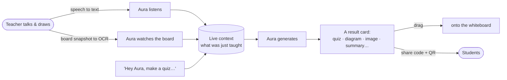
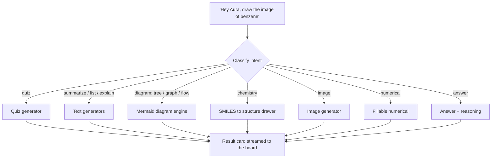
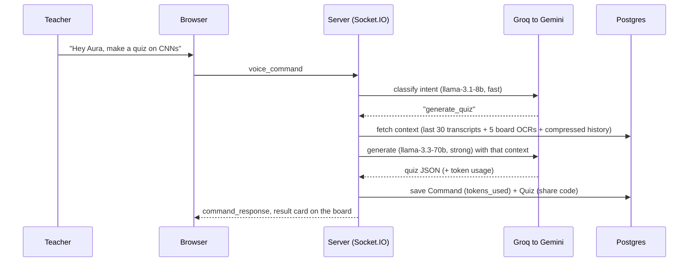
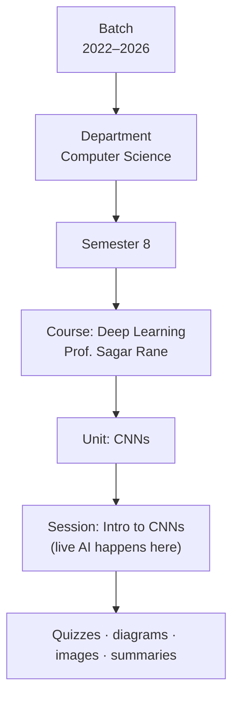
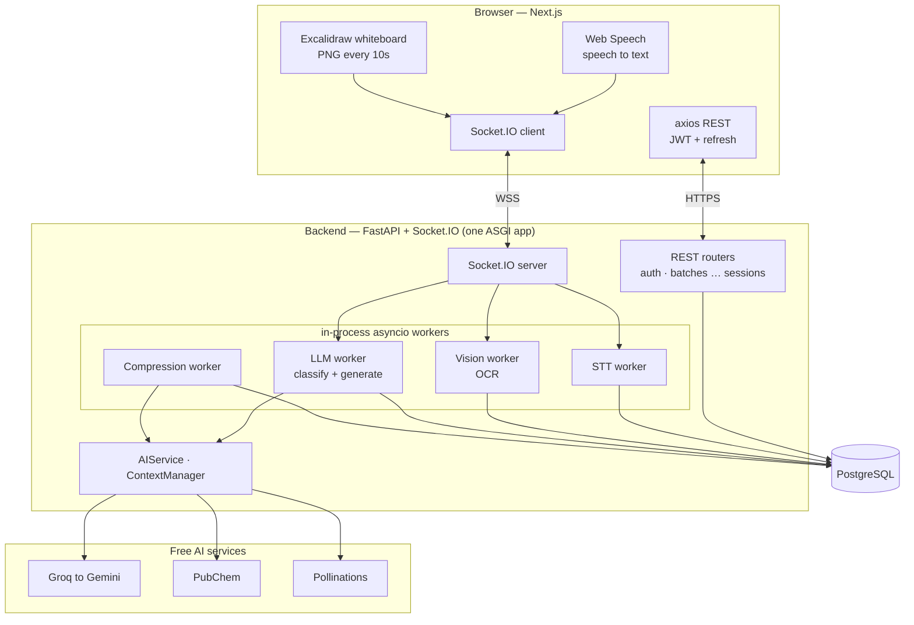

# Aura — A Real-Time Multi-Modal Teaching Assistant

**Aura is the AI that lives on your classroom whiteboard.** It sits on the smartboard
while a teacher teaches. It **listens** to what's being said, **watches** what's drawn on
the board, and the moment the teacher says **"Hey Aura, …"** it instantly produces the
thing they asked for — a quiz, a flow diagram, a chemical structure, a generated image, a
worked numerical, a summary — and drops it right onto the board, grounded in what was just
being taught.

No tab-switching, no copy-pasting from another tool, no breaking the flow of the class.
You talk, you draw, and Aura keeps up.



> Spec of record: [`AURA_BUILD.md`](./AURA_BUILD.md) · Design notes:
> [`DESIGN.md`](./DESIGN.md) · Product notes: [`PRODUCT.md`](./PRODUCT.md) ·
> Deploy guide: [`DEPLOY.md`](./DEPLOY.md).

---

## Live demo

- **App:** https://aura-frontend-qxgz.onrender.com
- **API:** https://aura-backend-hsce.onrender.com ([health check](https://aura-backend-hsce.onrender.com/health))

Sign in with one of the demo accounts:

| Role | Email | Password |
|---|---|---|
| Admin | `ankit@gmail.com` | `admin-password` |
| Teacher | `sagarrane@gmail.com` | `teacher-password` |

> Hosted on Render's free tier, so the first load after a while of inactivity can take
> ~50 seconds to wake up.

---

## What you can ask Aura to do

This is the heart of the app. While in a live class, the teacher either **says
"Hey Aura, …"** or types a command, and Aura figures out *what kind* of thing you want
and generates it. Here's the full menu, with real examples you can try:

### Quizzes
Turn whatever you just taught into a multiple-choice quiz, complete with a **shareable
code + QR** so students can take it on their phones — no login needed.
- *"Hey Aura, create a quiz on this"*
- *"Hey Aura, make a 5-question quiz on CNNs"*

### Summaries, lists & explanations
- *"Hey Aura, summarize this"* → a tidy summary with key points
- *"Hey Aura, list the types of neural networks"* / *"list this"* → a clean list
- *"Hey Aura, explain backpropagation"* → a clear explanation
- *"Hey Aura, give an example of recursion"* → a worked example

### Facts & answers
- *"Hey Aura, tell me an interesting fact about entropy"* → a fact (with a source when one's available)
- *"Hey Aura, what's the time complexity of quicksort?"* → a direct **answer + the reasoning** behind it

### Diagrams (flowcharts, trees, graphs, data structures)
Aura draws proper diagrams — not blurry pictures, but real, clean diagrams with nodes,
edges, values, and even traversals.
- *"Hey Aura, draw the flow diagram of asymmetric key cryptography"*
- *"Hey Aura, draw the image of a binary tree"*
- *"Hey Aura, draw the image of a Fenwick tree"*
- *"Hey Aura, draw a graph and show its BFS and DFS traversal"*
- *"Hey Aura, draw a stack / a queue"*

### Chemistry structures
Real molecular structures, drawn from the chemistry, not guessed.
- *"Hey Aura, draw the image of benzene"*
- *"Hey Aura, draw the structure of alcohol (ethanol)"*
- *"Hey Aura, show me the structure of glucose"*

### Images
For things that genuinely need a picture, Aura generates one.
- *"Hey Aura, draw an image of a neuron"*
- *"Hey Aura, show me an image of the solar system"*

### Numericals you can solve
- *"Hey Aura, give a numerical on Ohm's law"* → a fillable problem; type your answer and Aura checks it.

### Board cleanup
- *"Hey Aura, clean up the board"* → a tidied version of the messy whiteboard.

**How does Aura know which one you mean?** Every command is **classified into one
intent** first (quiz vs diagram vs chemistry vs image vs answer…), then handed to a
specialized generator. "Draw the image of benzene" routes to the chemistry engine,
"draw a binary tree" routes to the diagram engine, and "image of a neuron" routes to the
image generator — automatically.



Every result is **saved against the exact class it came from**, so it also becomes part
of that course's searchable library — and it can be **dragged onto the whiteboard**,
**read aloud (TTS)**, or **exported to Markdown / PDF**.

---

## Under the hood — how it actually works

Here's the full picture of what happens while a class is running, end to end.

### 1. The speech (what the teacher says)
The teacher's mic is read by the browser's **Web Speech API** (speech-to-text). Each
recognized chunk of text is sent to the server over a **WebSocket** as a
`transcript_text` event and **stored in the `transcripts` table** (linked to the
session). So the entire spoken lecture is captured, line by line, as it happens — this
becomes Aura's memory of what was taught.

### 2. The whiteboard snapshots (what the teacher draws)
The board is an **Excalidraw** canvas. While a session is recording, Aura **exports the board
as a PNG every 10 seconds** (`SNAPSHOT_INTERVAL_MS = 10_000`) and emits a
`canvas_snapshot` event. On the server, a **Vision worker** runs **OCR** on that image
(reads the text/equations/labels you drew), and the snapshot + extracted text are
**stored in the `whiteboard_logs` table** (the image is kept as base64 in Postgres at
demo scale). So Aura always knows the *current* state of the board, not just what was
said.

### 3. "Hey Aura" — the trigger
Everything you say is captured as transcript. But when Aura hears the wake phrase
**"Hey Aura, …"** (or you type a command), that text is sent as a `voice_command` and
kicks off the generation pipeline:



### 4. The context Aura reasons over
When generating, Aura fuses three things into the prompt: the **last 30 transcript
lines**, the **last 5 board OCR readings**, and a **compressed summary of everything
earlier** in the session. That's why a command like *"summarize this"* knows both what
you said *and* what's on the board.

### 5. Tokens & the live token chip
Context isn't infinite, so Aura tracks how big it's getting. It keeps a per-session
running estimate (roughly **1 token ≈ 4 characters**) and shows it as a **live token
chip** in the UI. Separately, the **actual tokens each AI call consumes** are recorded on
every **Command** (`tokens_used`), so usage rolls up into the stats dashboards at every
level (session → unit → course → … → batch).

### 6. Compression (so long classes don't overflow)
When the running context crosses the limit (**`COMPRESSION_TOKEN_LIMIT`, default 10,000
tokens**), a **Compression worker** kicks in automatically: it asks the AI to compress
the older buffer into a structured summary and saves it to the session's
**`compressed_history`** (a JSONB column). The UI shows `compression_started` →
`compression_complete` on the token chip. If the AI compression ever fails, Aura falls
back to an extractive summary so it never loses the thread. The result: a two-hour
lecture still fits in context, because the old parts live on as summaries while the
recent window stays verbatim.

### 7. The AI itself (Groq, with a fallback)
- **Classify** (which intent?) uses a **fast** model — Groq `llama-3.1-8b-instant`.
- **Generate** (the actual quiz/diagram/answer) uses a **strong** model — Groq
  `llama-3.3-70b-versatile`.
- If Groq is unavailable, Aura **falls back to Google Gemini**.
- For chemistry it uses **PubChem** (structure lookup) and for images **Pollinations** —
  both keyless and free. Only short prompts/compound names are sent to those, never your
  lecture content.

---

## The live classroom, step by step

1. A teacher opens a **unit** of their course and clicks **Start** with a subject
   (e.g. *"Intro to CNNs"*). This creates a **session** and drops them into the live
   classroom.
2. They **allow the microphone** — Aura starts transcribing (the "Hey Aura" wake phrase
   triggers a command; everything else is just captured as the lecture transcript).
3. They teach and **draw on the whiteboard** (powered by Excalidraw — pen/touch). Every ~10
   seconds Aura snapshots the board and reads it (OCR), so it always knows what's on
   screen.
4. They say **"Hey Aura, …"** (or type it). Aura combines the recent transcript + what's
   on the board + the session so far, generates the result, and shows it as a **card**.
5. They **drag the card onto the board**, **share a quiz code/QR** with the class, or
   keep going. When done, they **end the session** — everything stays saved under that
   unit.

Students can **join live** with a code to follow along, or take a shared **quiz** at
`/q/<code>` from any device.

---

## Where everything lives — the academic structure

Aura isn't a single shared whiteboard — it's organized exactly like a real college, so
every quiz, diagram, and session is filed under the right class. It's a six-level tree:

```
Batch              "2022–2026"                  <- an admission cohort (the joining/passing years)
└─ Department      "Computer Science"           <- creating one auto-makes Semesters 1–8
   └─ Semester     "Semester 8"                 <- the actual class a student belongs to
      └─ Course    "Deep Learning"  (Prof. Sagar Rane)   <- a subject, with a professor
         └─ Unit   "Convolutional Neural Networks"        <- a chapter
            └─ Session  "Intro to CNNs"          <- ONE live class — where "Hey Aura" happens
```



What each level means, in plain words:

| Level | What it is | Example |
|---|---|---|
| **Batch** | An admission cohort, named by its year range. | `2022–2026` |
| **Department** | A branch of study. Making one **auto-creates Semesters 1–8**. | Computer Science |
| **Semester** | The class a student actually belongs to (1 through 8). | Semester 8 |
| **Course** | A subject within a semester, taught by a professor. | *Deep Learning* — Prof. Sagar Rane |
| **Unit** | A chapter within a course. | Convolutional Neural Networks |
| **Session** | A single live class. **This is where the whiteboard + "Hey Aura" live.** | "Intro to CNNs" |

Because everything ultimately hangs off **sessions**, usage rolls up: each level has its
own **stats dashboard** (sessions, commands, quizzes, tokens used, the mix of intents)
covering everything beneath it.

---

## Who uses Aura — the three roles

You log in by **picking your role** (Admin / Teacher / Student) and entering your email +
password. The role you pick must match your real account — the server is the source of
truth. **There is no public signup; an admin creates every account.**

| Role | What they can do |
|---|---|
| **Admin** | Everything. Builds and edits the whole structure (batches, departments, courses, units, sessions) and creates/manages all the people. |
| **Teacher** | Runs classes in the semesters they're assigned to — adds courses & units, starts live sessions, uses "Hey Aura". |
| **Student** | Belongs to exactly one semester; sees their courses and material, and takes quizzes. |

**How people connect to classes.** A user isn't tied to a course directly — they're
linked to **semesters** (a link Aura calls a *membership*):
- A **student** has **exactly one** semester — that's their class. When they log in, Aura
  takes them straight into it.
- A **teacher** can have **many** semesters, even across different batches and departments
  (so one teacher can run the same subject for several cohorts).
- An **admin** isn't linked to any particular semester — they implicitly see and manage
  **all** of them.

Only an admin can create accounts and set these memberships, and an admin can later **move
a user to a different semester** (e.g. promote a whole class to the next sem). Aura always
keeps at least one active admin, so you can never lock yourself out.

**A real example — Sagar Rane (teacher).** In the demo data, Sagar Rane teaches across
several classes (Computer Science: Sem 8 of 2022–2026, Sem 6 of 2023–2027, Sem 4 of
2024–2028, Sem 2 of 2025–2029). His headline course is **Deep Learning** in CS Sem 8,
which already has 6 units (Foundations, DNNs, Intro to CNN, CNN, Deep Generative Models,
Reinforcement Learning). When Sagar logs in, he lands on *his* classes — not the whole
college — and can jump straight into teaching.

---

## How to actually use it (for someone who's never seen it)

### If you're an **Admin** — set up the college & the people

1. **Log in**: pick **Admin**, use the admin email/password. You land on the dashboard
   showing all **batches**.
2. **Build the structure** (top-down):
   - **New batch** → enter the year range (e.g. `2022–2026`).
   - Open the batch → **New department** (e.g. *Computer Science*). Semesters 1–8 appear
     automatically.
   - Open a department → a semester → **New course** (name, professor, cover, color).
   - Open a course → **New unit** (chapter name).
3. **Create users** — go to **People** (in the top menu). On the right is a **New
   account** form:
   - Enter **full name, email, a temporary password (8+ chars)**, and pick a **role**.
   - **Teacher** → choose a **department**, then tick the **semesters** they'll teach
     (across any batch). e.g. for Sagar: CS → tick Sem 8 (2022–2026), Sem 6 (2023–2027), …
   - **Student** → choose **batch → department → one semester** (a student belongs to
     exactly one).
   - **Admin** → no class assignment needed.
   - Click **Create account**.
4. **Manage people**: the People page is split into **Admins / Teachers / Students**.
   Use the **edit icon** on anyone to rename them, enable/disable the account, or
   **move them to another semester** (e.g. promote a student to next sem). The **delete
   icon** removes them.
5. **Edit / delete anything**: hover over any card (batch, department, course, unit) to
   reveal its **edit** and **delete** icons. Deletes show a **cascade warning** (e.g.
   deleting a batch tells you how many departments/semesters/courses go with it) so
   nothing disappears by surprise.

### If you're a **Teacher** (like Sagar Rane) — teach a class

1. **Log in**: pick **Teacher**, e.g. `sagarrane@gmail.com` / `teacher-password`. You see
   **your** classes.
2. Open your **course** (e.g. *Deep Learning*) → a **unit** (e.g. *CNNs*).
3. Type a subject and hit **Start** (e.g. *"Intro to CNNs"*) → you're in the live
   classroom.
4. **Allow the mic**, start teaching and drawing on the board.
5. Say **"Hey Aura, make a quiz on CNNs"** (or any command from the menu above). The
   result appears as a card — **drag it onto the board** or **share the quiz code** with
   the class.
6. **End the session** when finished. Everything is saved under that unit, and you'll see
   it in the course's stats and library.

### If you're a **Student** — learn & take quizzes

1. **Log in**: pick **Student**. You go straight to **your semester**.
2. Browse your **courses** and the material teachers generated.
3. Take a **quiz** from a shared link or QR (`/q/<code>`) — works on any phone, no login
   needed.

---

## Stack

| Layer | Tech |
|---|---|
| Frontend | Next.js 16 · React 19 · TypeScript · Tailwind v4 · Excalidraw (the whiteboard) · Mermaid (diagrams) · smiles-drawer (chemistry) · Socket.IO client · Zustand · recharts · next-themes (light/dark) |
| Backend | FastAPI · python-socketio · SQLAlchemy 2 · Alembic · Pydantic v2 · Argon2 · JWT (access + refresh) · structlog |
| AI (free tiers) | **Groq** primary (`llama-3.1-8b-instant` to classify, `llama-3.3-70b-versatile` to generate) → **Gemini** fallback. Keyless helpers: **PubChem** (chemistry structures) and **Pollinations** (images). Browser Web Speech for speech-to-text. |
| Data | PostgreSQL (no Redis — the realtime workers run in-process). |

---

## Architecture



```
Browser (Next.js)                         FastAPI + Socket.IO (one ASGI app)
  Web Speech - transcript_text -┐           ├- STT worker        -> transcripts
  "Hey Aura" - voice_command  --┤  WSS      ├- Vision worker     -> OCR -> whiteboard_logs
  Excalidraw - canvas_snapshot -┤ ------->   ├- LLM worker        -> classify -> fuse -> Groq/Gemini
  REST (axios, JWT + refresh) --┘           └- Compression worker (auto on token overflow)
                                            All workers are in-process asyncio tasks.
                                            Postgres   ·   Groq -> Gemini   ·   PubChem / Pollinations
```

One uvicorn process serves HTTP **and** WebSockets and runs the realtime workers — there's
no separate queue or Redis to operate.

**Command flow:** `voice/typed command -> classify intent (fast model) -> gather context
(recent transcripts + board OCR + compressed session history) -> generate (strong model) ->
save as a Command (+ a Quiz with a share code if it's a quiz) -> stream the result card
back over WebSocket`. A live **token chip** shows context usage; when it overflows, a
compression worker summarizes older history automatically.

---

## Data model

14 tables: `users` · `batches` · `departments` · `semesters` · `semester_members` ·
`courses` · `units` · `sessions` (+ compressed history) · `transcripts` ·
`whiteboard_logs` · `commands` · `quizzes` · `quiz_attempts` · `assignments`.

---

## Run it locally

**Prereqs:** Docker, Python 3.13, Node 20+, a free Groq key
([console.groq.com](https://console.groq.com)). Use Chrome/Edge for the voice features.

```bash
# 1. Postgres
docker compose up -d

# 2. Backend
cd backend
python3.13 -m venv .venv && .venv/bin/pip install -r requirements.txt
cp .env.example .env            # paste your GROQ_API_KEY
bash scripts/migrate.sh         # reset schema + migrate + seed the demo college
.venv/bin/uvicorn app.main:app --reload --port 8000

# 3. Frontend (new terminal)
cd frontend
npm install
cp .env.example .env.local
npm run dev                     # http://localhost:3000
```

`scripts/migrate.sh` builds the demo college: **4 batches, 16 departments, 128 semesters,
30 courses** (each with a professor) and the demo accounts. `seed_demo.py` is the source
of truth for that data — edit its `BATCHES` / `DEPARTMENTS` / `COURSES` / `UNITS` tables to
change it.

### Demo accounts

| Role | Email | Password |
|---|---|---|
| Admin | `ankit@gmail.com` | `admin-password` |
| Teacher | `sagarrane@gmail.com` | `teacher-password` |

Quickest tour: log in as the **teacher** → open **Deep Learning** → a unit → **Start** a
session → allow the mic → say **"Hey Aura, draw the flow diagram of asymmetric key
cryptography."**

---

## Deploy (Render — free tier)

The repo ships a Render **Blueprint** ([`render.yaml`](./render.yaml)) for three services:
`aura-db` (Postgres), `aura-backend` (FastAPI + Socket.IO), and `aura-frontend` (Next.js),
all in the Singapore region. The backend runs migrations + an idempotent demo seed on boot.
The full step-by-step — connecting the repo, the secrets to set, and the build-time env-var
gotcha — is in **[`DEPLOY.md`](./DEPLOY.md)**.

---

## Tests

```bash
cd backend && .venv/bin/python -m pytest -q     # 74 tests (auth, RBAC, hierarchy CRUD, AI parsing, API)
cd frontend && npx vitest run                    # 24 tests
```

> Backend tests reset the DB schema, so re-run `bash scripts/migrate.sh` afterward to
> restore the demo data.

---

## API overview

```
GET  /health · /health/db
POST /auth/login · /auth/refresh        GET/PATCH/DELETE /auth/me
     /batches · /departments · /semesters · /courses · /units      (CRUD, role-gated)
POST /sessions   GET /sessions/{id}   GET /sessions/{id}/history   POST /sessions/{id}/end
GET  /admin/users · /admin/tree · /admin/stats        POST/PATCH/DELETE /admin/users
GET  /quizzes/{id}/results       /q/<code> page is PUBLIC (no auth)
GET  /assignments · /live/{join_code} · /library · /stats/* · /export/{id} (Markdown)
WS   in:  transcript_text · audio_chunk · canvas_snapshot · voice_command · ping
WS   out: transcript_update · command_response · board_insight · compression_* · context_update · error
```

---

## FAQ

**Do I sign up?** No. An admin creates your account and tells you your email + temporary
password. Pick your role on the login screen and log in.

**I picked the wrong role and it won't let me in.** The role selector must match your real
account type. If you're a teacher, pick **Teacher**. Aura will even tell you which one to
pick.

**How does Aura "see" my whiteboard?** Every ~10 seconds it takes a snapshot of the board
and reads it with OCR, so it can answer using what you've drawn, not just what you've said.

**Do I have to say "Hey Aura"?** That's the wake phrase for *commands*. Everything else
you say is just captured as the lecture transcript (used as context). You can also **type**
commands instead of speaking.

**Where do my quizzes/diagrams go?** They're saved against the exact unit/session you made
them in, so they show up in that course's library and stats. Quizzes also get a shareable
code + QR.

**Can students use it live?** Yes — they can join a session with a code to follow along, or
take a shared quiz at `/q/<code>` from any device with no login.

**Is it free to run?** The AI uses free tiers (Groq, with Gemini as a fallback) plus keyless
helpers (PubChem for chemistry, Pollinations for images). Hosting on Render's free tier is
$0 (with cold starts after idle).

---

## Security

Argon2 password hashing · JWT (algorithm allow-listed, access/refresh types checked) ·
**no self-signup; roles are admin-assigned** · object-level access checks on every route
(a teacher can't touch a semester they aren't a member of) · the WebSocket derives your
session from the authenticated socket, never from the client payload · ORM-only queries ·
Mermaid rendered with `securityLevel: strict` · a CORS allow-list shared by HTTP and
WebSocket · secrets only ever come from environment variables.
